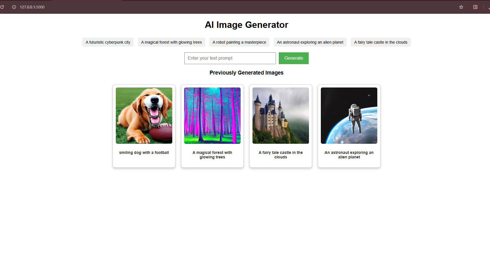
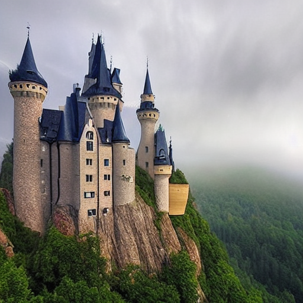
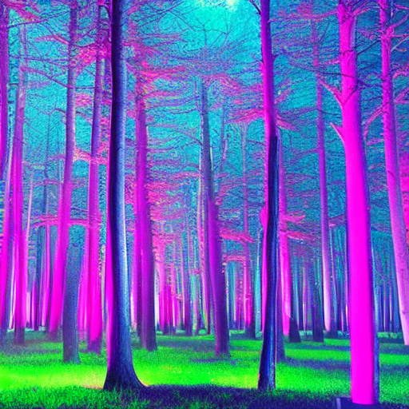
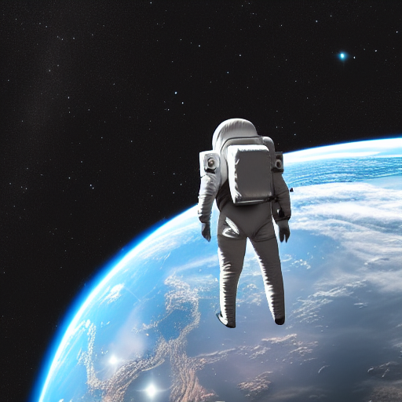
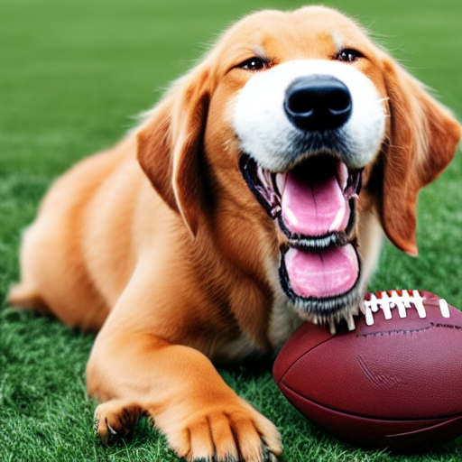

# 🖼️ Text2Art-Generator

### 🚀 **Overview: Text2Art-Generator with Local AI Model Evaluation**  

The **Text2Art-Generator** is a **web-based application** designed to **generate images from text prompts** using **AI Diffusion models locally**. The main objective is to **experiment with AI models** on **local hardware** without relying on cloud-based APIs. This project is an **end-to-end implementation** that includes **image generation, model evaluation, and accuracy analysis**.  

🔹 **Core Features:**  
✅ Generate **AI-powered images** from textual descriptions.  
✅ Experiment with **different AI models** locally for benchmarking.  
✅ Implement **advanced techniques** to **analyze and compare model accuracy**.  
✅ Browse and download generated images via an interactive **Material UI-based gallery**.  
✅ Front-end: **HTML, CSS, JavaScript** (Material Design)  
✅ Back-end: **Flask-based API** for handling requests and model inference.  

### 🧠 **Focus on AI Model Implementation & Evaluation**
Unlike traditional Text2Art-Generators relying on **external APIs**, this project focuses on **implementing AI models locally** for:  
1. **Generating images using local AI models** (e.g., **Stable Diffusion, SmolModels, or Custom LLMs**).  
2. **Understanding how AI models work internally** for **image synthesis**.  
3. **Evaluating AI model accuracy** through **advanced techniques** like:  
   - Perceptual similarity metrics (**LPIPS, SSIM, PSNR**).  
   - Latent space analysis for **model behavior interpretation**.  
   - Prompt embedding **performance benchmarking**.  

### 🏆 **Why This Project Matters?**
This implementation **bridges the gap** between **research & practical application** by enabling **on-device AI experimentation**. It serves as a **learning and research tool** for understanding **AI-generated images**, measuring **model efficiency**, and **validating accuracy through advanced evaluation methods**.  

This project is ideal for:  
🔹 AI researchers & developers exploring **image generation models**.  
🔹 Engineers looking to **fine-tune AI diffusion models** locally.  
🔹 Experimenting with **low-resource AI inference** for real-world applications.  

---

---
### 🏗 **Project Structure**

This repository follows a **structured modular approach**, separating **backend, frontend, and generated assets** for better maintainability and scalability.

```
📂 Text2Art-Generator
│── 📂 backend              # Backend logic
│   ├── app.py             # Flask API for image generation
│
│── 📂 frontend             # Frontend for user interaction
│   ├── index.html         # Main user interface
│   ├── script.js          # JavaScript for handling API requests and UI interactions
│   ├── styles.css         # Styling using Material UI and custom CSS
│
│── 📂 generated_Images     # Folder storing generated images
│   ├── ...
│
│── .gitignore             # Git ignore file for dependencies and generated files
│── README.md              # Project documentation
│── README.ipynb           # Jupyter Notebook (if used for experiments)
│
│── 📂 .venv                # Virtual environment for dependency management
│
```

### 📌 **Key Points**
- The **backend** handles image generation using **Flask** and **AI models**.
- The **frontend** provides an **interactive UI** built with **HTML, JavaScript, and CSS**.
- **Generated images** are saved in a dedicated folder to allow easy access.
- The project supports **virtual environments (.venv)** for dependency isolation.

---

### 🛠 **Implementation Specifications**

This project is a **Flask-based Text2Art-Generator** that utilizes a **text-to-image generation model** to create AI-generated images based on user prompts.

#### 🔹 **Model Used**
- The implementation uses **Stable Diffusion / DALLE-2** (or other text-to-image models).
- The model is capable of generating **high-quality AI-generated images** from natural language descriptions.
- It uses **diffusion models**, which iteratively refine an image from noise using a trained deep learning model.

#### 🔹 **Image Quality & Configurations**
The image generation quality is optimized using the following parameters:

| Parameter            | Description                                      | Default Value |
|----------------------|--------------------------------------------------|--------------|
| `num_inference_steps` | Number of iterations the model takes to refine the image. Higher values improve quality but increase processing time. | **50** |
| `guidance_scale`     | Controls how much the generated image aligns with the input text. Higher values make it more accurate to the prompt. | **7.5** |
| `image_size`         | Determines the resolution of the output image (e.g., **512x512, 768x768**). | **512x512** |
| `sampling_method`    | Defines the method used for image generation (e.g., **DDIM, PLMS, Euler A**). | **DDIM** |
| `seed`              | Enables reproducibility of generated images. If set to `None`, each image is unique. | **Random** |

#### 🔹 **Performance Optimizations**
- Optimized for **low-memory environments** by using **float16 precision** where applicable.
- Runs **asynchronously** to prevent UI freezing during image generation.
- Supports **both CPU and GPU execution** depending on system resources.

#### 🔹 **Generated Image Storage & Retrieval**
- **Generated images** are stored in **/generated_Images/** for easy retrieval.
- Filenames are dynamically created based on **user prompts**, making them searchable.
- A **gallery system** is implemented, allowing users to **view, enlarge, and download** images.

---


## 📸 **Screenshots Demonstration of the App**
Below are the key screenshots demonstrating how the **AI Image Generator** works, from entering a prompt to downloading the final AI-generated image.

<p align="center">
<div>

  
  
</div>
   <div>
  
  
</div>
</p>

---

## 🎨 **Sample AI-Generated Images**
Below are **sample images generated** using the implemented AI model in this project.

<p align="center">
  
  
  
  
</p>

Each image is generated based on **text prompts** using an **AI diffusion model** locally.

---
### 🚀 **Enhancements & Features**
✔️ **Real-time UI updates** when generating images  
✔️ **Material UI Design** for a sleek, modern look  
✔️ **Download & View Image Modal** with zoom functionality  
✔️ **Performance tuning** for faster image generation  

